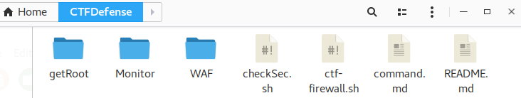
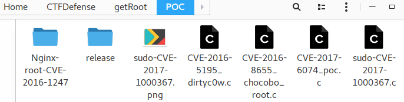
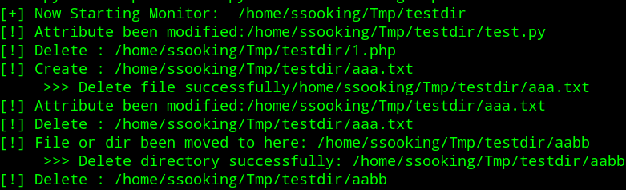

#CTFDefense
Some tools for CTF off line

###1.ctf-firewall.sh
    iptables配置命令，可一键执行快速配置。使用时可能需要根据环境略微修改
	
###2.commannd.md
	一些线下赛中常用的linux操作命令

###3.getRoot
	一些本地提权poc，每个文件里都有详细的使用注释，编译好的文件在release目录下。还有几个实用脚本

###4.Monitor
	一个简单的文件监控示例脚本，可以监控创建、删除、移动、属性修改操作，自动删除新增文件。已使用pyinstaller打包成了linux可执行程序

###5. WAF
	linux版安全狗和几个waf脚本

